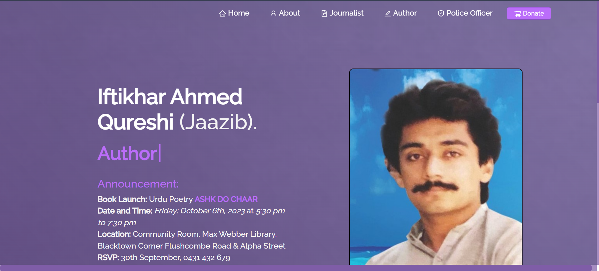
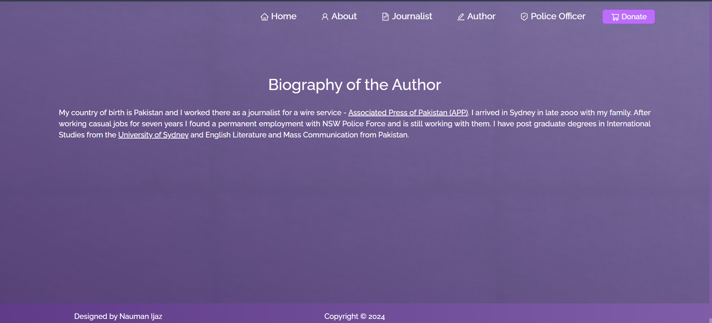
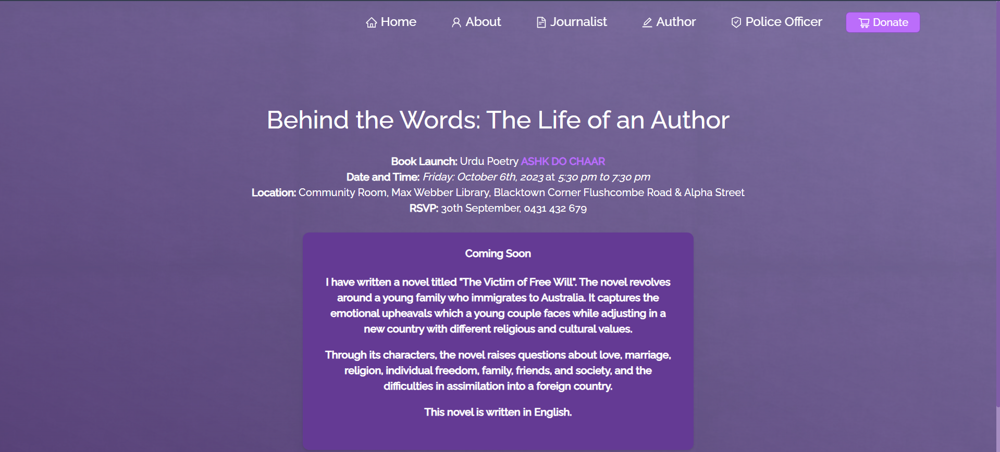
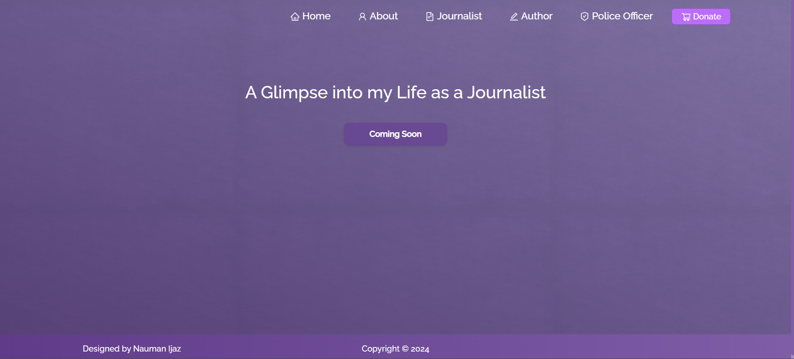
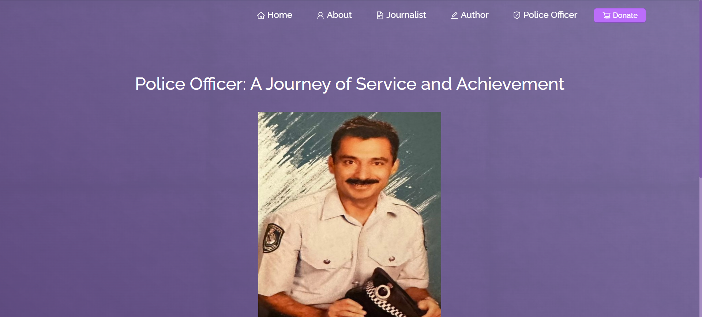

# Iftikhar Biography Website

## Project Overview

This website is a tribute to the memory of **Iftikhar Ahmed**, an individual who left a lasting legacy through his poetic talent, service as a police officer, and dedication to journalism. The website serves as a space to honor his memory and reflect on the significant contributions he made during his lifetime.

## Features

- **Author Tribute**: Explore the life and accomplishments of Iftikhar Ahmed, celebrating his roles as a poet, police officer, and journalist.
- **Book Purchase Link (Depreciated)**: A dedicated link to purchase Iftikhar Ahmed's book through the NSW Police Department's donation store, allowing readers to continue appreciating his literary work while supporting a worthy cause.

## Screenshots of the Application

-   
  _This is the main landing page, featuring an overview of Iftikhar Ahmed's life and work._

-   
  _An about page providing detailed information on Iftikhar's background and legacy._

-   
  _A section dedicated to his work as a poet and author, showcasing his literary contributions._

-   
  _A tribute to his time as a journalist, highlighting key articles and works._

-   
  _A page honoring his service as a police officer, with information about his career in law enforcement._

## Hosted Platform

- The application is currently hosted on **Vercel**
- [Link to live application](https://iftikhar-biography-website.vercel.app/)
